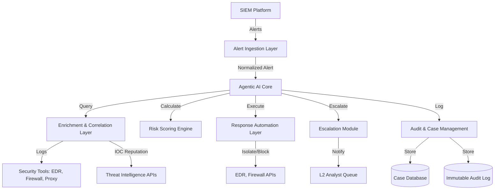

# Design Document: AutoSOC Platform

## Overview

AutoSOC is an Agentic AI-powered Security Operations Center (SOC) Level 1 automation platform that autonomously triages security alerts, performs contextual enrichment, calculates risk scores, executes containment actions, and escalates high-risk incidents. The system is designed to reduce alert fatigue, automate repetitive tasks, improve Mean Time to Respond (MTTR), and enable intelligent security automation.

The platform follows a modular, event-driven architecture with six core layers:

1. **Alert Ingestion Layer**: Receives and normalizes alerts from SIEM platforms
2. **Agentic AI Reasoning Layer**: Central decision-making engine using LLM-based analysis
3. **Enrichment & Correlation Layer**: Fetches related logs and threat intelligence
4. **Risk Scoring Layer**: Calculates dynamic risk scores based on multiple factors
5. **Response Automation Layer**: Executes containment actions via security tool APIs
6. **Case Management & Audit Layer**: Maintains case records and immutable audit logs

The Agentic AI Core acts as the orchestrator, planning investigation steps, selecting appropriate tools, executing actions, and validating results before updating case records.

## Architecture

### High-Level Architecture



### Deployment Architecture

The system is designed as a containerized microservices architecture for horizontal scalability:

- **API Gateway**: Handles authentication, rate limiting, and request routing
- **Alert Ingestion Service**: Stateless service for receiving and normalizing alerts
- **AI Agent Service**: Stateful service managing agent reasoning and tool orchestration
- **Enrichment Service**: Stateless service for parallel log correlation and threat intelligence queries
- **Risk Scoring Service**: Stateless service for risk calculation
- **Response Automation Service**: Stateful service for executing and tracking containment actions
- **Case Management Service**: Manages case CRUD operations and audit logging
- **Message Queue**: Decouples services and enables asynchronous processing (RabbitMQ/Kafka)
- **Cache Layer**: Redis for threat intelligence caching and session management
- **Database**: PostgreSQL for case data, MongoDB for audit logs

### Security Architecture

- **Authentication**: OAuth2/SAML integration with enterprise SSO
- **Authorization**: Role-Based Access Control (RBAC) with four roles: Admin, L1_Analyst, L2_Analyst, Viewer
- **Encryption**: TLS 1.2+ for all API communications, AES-256 for data at rest
- **Secret Management**: Integration with HashiCorp Vault or AWS Secrets Manager
- **Network Segmentation**: Services deployed in isolated VPCs with security groups
- **Audit Trail**: Immutable append-only logs for compliance

## Components and Interfaces

### 1. Alert Ingestion Module

**Responsibilities:**
- Receive alerts from SIEM platforms via REST API
- Validate alert structure and required fields
- Normalize alerts to internal format
- Assign unique case identifiers
- Publish normalized alerts to message queue

**Interfaces:**

```typescript
interface AlertIngestionAPI {
  // POST /api/v1/alerts
  ingestAlert(alert: RawAlert): Promise<CaseID>
  
  // GET /api/v1/alerts/health
  healthCheck(): Promise<HealthStatus>
}

interface RawAlert {
  format: 'JSON' | 'CEF'
  source: string
  timestamp: ISO8601Timestamp
  severity: 'low' | 'medium' | 'high' | 'critical'
  content: string | object
  metadata?: Record<string, any>
}

interface NormalizedAlert {
  caseId: string
  source: string
  timestamp: ISO8601Timestamp
  severity: AlertSeverity
  title: string
  description: string
  rawContent: string
  metadata: Record<string, any>
}
```

**Processing Logic:**
1. Validate incoming alert format (JSON or CEF)
2. Check for required fields: source, timestamp, severity, content
3. Generate unique case ID (UUID v4)
4. Normalize to internal format
5. Retry logic: 3 attempts with exponential backoff (1s, 2s, 4s)
6. Publish to `alerts.normalized` queue

### 2. Agentic AI Core

**Responsibilities:**
- Parse alert content using LLM to extract structured information
- Extract IOCs (IPs, domains, file hashes, URLs, emails)
- Plan investigation steps based on alert type
- Orchestrate enrichment and correlation activities
- Make containment and escalation decisions
- Generate explainable reasoning for audit trail

**Interfaces:**

```typescript
interface AgenticAICore {
  analyzeAlert(alert: NormalizedAlert): Promise<AnalysisResult>
  extractIOCs(alertContent: string): Promise<IOC[]>
  planInvestigation(analysis: AnalysisResult): Promise<InvestigationPlan>
  executeInvestigation(plan: InvestigationPlan): Promise<InvestigationResult>
  makeDecision(result: InvestigationResult): Promise<Decision>
}

interface AnalysisResult {
  caseId: string
  summary: string
  alertType: string
  affectedAssets: Asset[]
  iocs: IOC[]
  reasoning: string
  confidence: number // 0-100
}

interface IOC {
  type: 'ip' | 'domain' | 'file_hash' | 'url' | 'email'
  value: string
  normalized: string
  context: string
}

interface InvestigationPlan {
  steps: InvestigationStep[]
  estimatedDuration: number
}

interface InvestigationStep {
  action: 'correlate_logs' | 'enrich_ioc' | 'query_edr' | 'check_user'
  parameters: Record<string, any>
  timeout: number
}

interface Decision {
  action: 'close' | 'contain' | 'escalate'
  riskScore: number
  reasoning: string
  containmentActions?: ContainmentAction[]
}
```

**LLM Integration:**
- Model: GPT-4 or Claude 3 for alert analysis
- Prompt Engineering: Structured prompts with few-shot examples
- Output Parsing: JSON mode for structured extraction
- Fallback: Rule-based extraction if LLM fails

**Agent Workflow:**
1. Receive normalized alert
2. LLM analyzes alert content → extract summary, alert type, affected assets
3. LLM extracts IOCs → normalize formats
4. Generate investigation plan based on alert type
5. Execute plan steps in parallel where possible
6. Aggregate results
7. Calculate risk score
8. Make decision (close/contain/escalate)
9. Log all steps with reasoning

### 3. Enrichment & Correlation Layer

**Responsibilities:**
- Query integrated security tools for related logs
- Correlate logs based on IOCs, users, hosts, and time windows
- Query threat intelligence APIs for IOC reputation
- Cache threat intelligence results to reduce API costs
- Handle timeouts and partial failures gracefully

**Interfaces:**

```typescript
interface EnrichmentService {
  correlateLogs(iocs: IOC[], timeWindow: TimeWindow): Promise<CorrelatedLogs>
  enrichIOCs(iocs: IOC[]): Promise<EnrichmentResult[]>
}

interface CorrelatedLogs {
  caseId: string
  logs: LogEntry[]
  correlationMatches: CorrelationMatch[]
  sources: string[]
}

interface LogEntry {
  source: string
  timestamp: ISO8601Timestamp
  eventType: string
  content: string
  matchedIOCs: string[]
}

interface CorrelationMatch {
  type: 'ioc' | 'user' | 'host' | 'session'
  value: string
  logCount: number
  timeSpan: number
}

interface EnrichmentResult {
  ioc: IOC
  reputation: ReputationScore
  threatCategories: string[]
  historicalActivity: string
  sources: string[]
  cached: boolean
}

interface ReputationScore {
  score: number // 0-100
  verdict: 'benign' | 'suspicious' | 'malicious'
  confidence: number
}
```

**Log Correlation Logic:**
1. Receive IOCs and time window (default: 24 hours before alert)
2. Query integrated tools in parallel:
   - EDR: Process execution, file activity, network connections
   - Firewall: Network traffic logs
   - Proxy: Web requests
   - Authentication: Login events
3. Timeout: 30 seconds per source
4. Match logs containing IOCs, related users, or affected hosts
5. Return aggregated results with correlation metadata

**Threat Intelligence Integration:**
- Supported providers: VirusTotal, AbuseIPDB, AlienVault OTX
- Query strategy: Parallel queries with 10-second timeout per provider
- Caching: Redis with 1-hour TTL
- Rate limiting: Respect API limits, queue requests if needed
- Aggregation: Combine scores from multiple sources (weighted average)

### 4. Risk Scoring Engine

**Responsibilities:**
- Calculate dynamic risk scores (0-100) based on multiple factors
- Factor in alert severity, IOC reputation, affected assets, user privilege
- Provide explainable scoring methodology
- Support configurable scoring weights

**Interfaces:**

```typescript
interface RiskScoringEngine {
  calculateRiskScore(context: RiskContext): Promise<RiskScore>
}

interface RiskContext {
  alert: NormalizedAlert
  iocs: IOC[]
  enrichment: EnrichmentResult[]
  correlatedLogs: CorrelatedLogs
  affectedAssets: Asset[]
}

interface RiskScore {
  score: number // 0-100
  factors: RiskFactor[]
  methodology: string
  threshold: 'low' | 'medium' | 'high' | 'critical'
}

interface RiskFactor {
  name: string
  weight: number
  value: number
  contribution: number
}

interface Asset {
  type: 'user' | 'host' | 'service'
  identifier: string
  privilegeLevel: 'standard' | 'elevated' | 'admin'
  criticality: 'low' | 'medium' | 'high' | 'critical'
}
```

**Risk Scoring Formula:**

```
RiskScore = (
  AlertSeverity * 0.25 +
  MaxIOCReputation * 0.30 +
  AssetCriticality * 0.20 +
  PrivilegeLevel * 0.15 +
  CorrelationDensity * 0.10
) * 100

Where:
- AlertSeverity: low=0.25, medium=0.5, high=0.75, critical=1.0
- MaxIOCReputation: Highest reputation score from enrichment (0-1)
- AssetCriticality: low=0.25, medium=0.5, high=0.75, critical=1.0
- PrivilegeLevel: standard=0.33, elevated=0.66, admin=1.0
- CorrelationDensity: (matched_logs / total_logs_in_window) capped at 1.0
```

**Thresholds:**
- Low: 0-40
- Medium: 41-60
- High: 61-79
- Critical: 80-100

### 5. Response Automation Layer

**Responsibilities:**
- Execute containment actions based on risk score and alert type
- Integrate with security tool APIs (EDR, firewall, IAM)
- Verify successful execution
- Support rollback for false positives
- Require RBAC validation before execution

**Interfaces:**

```typescript
interface ResponseAutomationService {
  executeContainment(decision: Decision, caseId: string): Promise<ContainmentResult>
  rollbackAction(actionId: string): Promise<RollbackResult>
  verifyAction(actionId: string): Promise<VerificationResult>
}

interface ContainmentAction {
  type: 'isolate_endpoint' | 'block_ip' | 'disable_account' | 'quarantine_file'
  target: string
  parameters: Record<string, any>
  requiresApproval: boolean
}

interface ContainmentResult {
  actionId: string
  success: boolean
  actions: ExecutedAction[]
  failures: FailedAction[]
}

interface ExecutedAction {
  actionId: string
  type: string
  target: string
  timestamp: ISO8601Timestamp
  result: string
  rollbackSupported: boolean
}

interface FailedAction {
  type: string
  target: string
  error: string
  retryAttempted: boolean
}
```

**Containment Logic:**
1. Check if risk score >= 80 (configurable threshold)
2. Determine containment actions based on alert type:
   - Malware detection → Isolate endpoint
   - C2 communication → Block IP at firewall
   - Compromised account → Disable account
3. Validate RBAC permissions
4. Execute actions via security tool APIs
5. Verify execution (query tool to confirm action applied)
6. Retry once if failure
7. Log all actions with timestamps
8. Escalate if retry fails

**Supported Integrations:**
- EDR: CrowdStrike, SentinelOne, Microsoft Defender
- Firewall: Palo Alto, Cisco, Fortinet
- IAM: Active Directory, Okta, Azure AD

### 6. Escalation Module

**Responsibilities:**
- Escalate high-risk cases to L2 analyst queue
- Generate structured case summaries
- Send notifications via configured channels
- Provide AI-generated escalation reasoning

**Interfaces:**

```typescript
interface EscalationService {
  escalateCase(caseId: string, reason: string): Promise<EscalationResult>
  generateCaseSummary(caseId: string): Promise<CaseSummary>
  notifyAnalysts(escalation: EscalationResult): Promise<NotificationResult>
}

interface EscalationResult {
  escalationId: string
  caseId: string
  timestamp: ISO8601Timestamp
  reason: string
  summary: CaseSummary
  assignedTo: string
}

interface CaseSummary {
  caseId: string
  alertTitle: string
  riskScore: number
  iocs: IOC[]
  enrichmentSummary: string
  actionsT: string[]
  reasoning: string
  recommendedNextSteps: string[]
}

interface NotificationResult {
  channels: NotificationChannel[]
  success: boolean
}

interface NotificationChannel {
  type: 'email' | 'slack' | 'ticketing'
  recipient: string
  sent: boolean
}
```

**Escalation Triggers:**
- Risk score >= 80
- Containment action failure after retry
- Manual escalation request from L1 analyst

**Case Summary Generation:**
1. Aggregate all case data (alert, IOCs, enrichment, logs, actions)
2. LLM generates human-readable summary
3. Include timeline of events
4. Provide recommended next steps based on alert type
5. Attach all raw data for deep investigation

### 7. Case Management & Audit Layer

**Responsibilities:**
- Store case records with all investigation data
- Maintain immutable audit logs
- Support case queries and exports
- Enable compliance reporting

**Interfaces:**

```typescript
interface CaseManagementService {
  createCase(alert: NormalizedAlert): Promise<Case>
  updateCase(caseId: string, update: CaseUpdate): Promise<Case>
  getCase(caseId: string): Promise<Case>
  queryCases(filter: CaseFilter): Promise<Case[]>
  exportCase(caseId: string, format: 'json' | 'pdf'): Promise<ExportResult>
}

interface AuditService {
  logAction(action: AuditEntry): Promise<void>
  queryAuditLog(filter: AuditFilter): Promise<AuditEntry[]>
  exportAuditLog(filter: AuditFilter, format: 'json' | 'csv'): Promise<ExportResult>
}

interface Case {
  caseId: string
  status: 'open' | 'investigating' | 'contained' | 'escalated' | 'closed'
  createdAt: ISO8601Timestamp
  updatedAt: ISO8601Timestamp
  alert: NormalizedAlert
  analysis: AnalysisResult
  iocs: IOC[]
  enrichment: EnrichmentResult[]
  correlatedLogs: CorrelatedLogs
  riskScore: RiskScore
  decision: Decision
  actions: ExecutedAction[]
  escalation?: EscalationResult
  closureReason?: string
}

interface AuditEntry {
  entryId: string
  timestamp: ISO8601Timestamp
  caseId: string
  actor: 'ai_agent' | 'user'
  actorId: string
  action: string
  input: any
  output: any
  reasoning?: string
  llmPrompt?: string
  llmResponse?: string
}
```

**Audit Log Requirements:**
- Append-only storage (MongoDB with write-once collections)
- Cryptographic hashing for tamper detection
- Include all AI decisions with reasoning
- Store LLM prompts and responses for explainability
- Retention: 2 years (configurable)
- Compliance: SOC 2, GDPR, HIPAA support

## Data Models

### Alert Data Model

```typescript
type AlertSeverity = 'low' | 'medium' | 'high' | 'critical'
type AlertStatus = 'new' | 'analyzing' | 'enriching' | 'scored' | 'actioned' | 'escalated' | 'closed'

interface Alert {
  caseId: string
  source: string
  timestamp: ISO8601Timestamp
  severity: AlertSeverity
  status: AlertStatus
  title: string
  description: string
  rawContent: string
  metadata: Record<string, any>
}
```

### IOC Data Model

```typescript
type IOCType = 'ip' | 'domain' | 'file_hash' | 'url' | 'email'
type HashType = 'md5' | 'sha1' | 'sha256'

interface IOC {
  type: IOCType
  value: string
  normalized: string
  context: string
  extractedAt: ISO8601Timestamp
  hashType?: HashType
}
```

### Enrichment Data Model

```typescript
type Verdict = 'benign' | 'suspicious' | 'malicious'

interface EnrichmentResult {
  ioc: IOC
  reputation: {
    score: number // 0-100
    verdict: Verdict
    confidence: number
  }
  threatCategories: string[]
  historicalActivity: string
  sources: string[]
  queriedAt: ISO8601Timestamp
  cached: boolean
}
```

### Risk Score Data Model

```typescript
type RiskThreshold = 'low' | 'medium' | 'high' | 'critical'

interface RiskScore {
  score: number // 0-100
  threshold: RiskThreshold
  factors: RiskFactor[]
  methodology: string
  calculatedAt: ISO8601Timestamp
}

interface RiskFactor {
  name: string
  weight: number
  value: number
  contribution: number
}
```

### Containment Action Data Model

```typescript
type ActionType = 'isolate_endpoint' | 'block_ip' | 'disable_account' | 'quarantine_file'
type ActionStatus = 'pending' | 'executing' | 'success' | 'failed' | 'rolled_back'

interface ContainmentAction {
  actionId: string
  caseId: string
  type: ActionType
  target: string
  status: ActionStatus
  executedAt?: ISO8601Timestamp
  result?: string
  error?: string
  rollbackSupported: boolean
  rolledBackAt?: ISO8601Timestamp
}
```

### Case Data Model

```typescript
type CaseStatus = 'open' | 'investigating' | 'contained' | 'escalated' | 'closed'

interface Case {
  caseId: string
  status: CaseStatus
  createdAt: ISO8601Timestamp
  updatedAt: ISO8601Timestamp
  closedAt?: ISO8601Timestamp
  
  // Alert data
  alert: Alert
  
  // Analysis data
  analysis: AnalysisResult
  iocs: IOC[]
  
  // Enrichment data
  enrichment: EnrichmentResult[]
  correlatedLogs: CorrelatedLogs
  
  // Risk assessment
  riskScore: RiskScore
  
  // Decision and actions
  decision: Decision
  actions: ContainmentAction[]
  
  // Escalation
  escalation?: EscalationResult
  
  // Closure
  closureReason?: string
  closedBy?: string
}
```

### Audit Log Data Model

```typescript
type ActorType = 'ai_agent' | 'user'

interface AuditEntry {
  entryId: string
  timestamp: ISO8601Timestamp
  caseId: string
  
  // Actor information
  actor: ActorType
  actorId: string
  
  // Action details
  action: string
  input: any
  output: any
  
  // AI explainability
  reasoning?: string
  llmPrompt?: string
  llmResponse?: string
  
  // Integrity
  hash: string
  previousHash: string
}
```


## Correctness Properties

*A property is a characteristic or behavior that should hold true across all valid executions of a system—essentially, a formal statement about what the system should do. Properties serve as the bridge between human-readable specifications and machine-verifiable correctness guarantees.*

### Property 1: Alert Format Support

*For any* valid alert in JSON or CEF format, the ingestion module should successfully parse and normalize the alert into the internal format.

**Validates: Requirements 1.2**

### Property 2: Alert Validation and Error Handling

*For any* alert with missing required fields (source, timestamp, severity, or content), the ingestion module should reject the alert with a validation error and not create a case.

**Validates: Requirements 1.3**

### Property 3: Case ID Uniqueness

*For any* set of ingested alerts, all generated case IDs should be unique (no duplicates).

**Validates: Requirements 1.4**

### Property 4: Comprehensive IOC Extraction and Normalization

*For any* alert containing IOCs (IP addresses, domains, file hashes, URLs, emails), the AI core should:
- Extract all unique IOCs present in the alert
- Normalize each IOC to standard format (lowercase domains, defanged URLs, uppercase hashes)
- Return all extracted IOCs without duplicates

**Validates: Requirements 2.2, 2.3, 2.4**

### Property 5: Log Correlation Completeness

*For any* alert with extracted IOCs and a specified time window, the enrichment service should:
- Query all configured security tools for logs within the time window
- Attach all found logs to the case with timestamps and source identifiers
- Correlate logs based on IOC matches, user identifiers, and host identifiers

**Validates: Requirements 3.1, 3.3, 3.4**

### Property 6: Threat Intelligence Enrichment

*For any* extracted IOC, the enrichment service should:
- Query configured threat intelligence APIs
- Return enrichment results containing reputation score, threat categories, and historical activity
- Flag IOCs with reputation scores > 70 as high-risk

**Validates: Requirements 4.1, 4.3, 4.4**

### Property 7: Threat Intelligence Caching

*For any* IOC queried within a 1-hour window, subsequent queries for the same IOC should return cached results without making additional API calls.

**Validates: Requirements 4.6**

### Property 8: Risk Score Bounds and Calculation

*For any* completed alert analysis, the risk scoring engine should:
- Calculate a risk score between 0 and 100 (inclusive)
- Factor in alert severity, IOC reputation, affected assets, and user privilege level
- Store the calculation methodology in the case record
- Assign higher scores when multiple high-risk factors are present

**Validates: Requirements 5.1, 5.2, 5.5**

### Property 9: Containment Triggering

*For any* case with a risk score >= 80 (or configured threshold), the response automation service should execute predefined containment actions based on the alert type.

**Validates: Requirements 6.1**

### Property 10: Containment Verification and Logging

*For any* executed containment action, the response automation service should:
- Verify successful execution via the security tool API
- Log the action result with timestamp and target
- Include verification status in the case record

**Validates: Requirements 6.4**

### Property 11: Containment Rollback Support

*For any* containment action that supports rollback, executing the rollback should restore the system to its pre-containment state (e.g., un-isolate endpoint, unblock IP).

**Validates: Requirements 6.6**

### Property 12: High-Risk Escalation

*For any* case with a risk score >= 80 (or configured threshold), the escalation service should:
- Escalate the case to the L2 analyst queue
- Generate a structured case summary with all required fields
- Include an AI-generated explanation of the escalation decision

**Validates: Requirements 7.1, 7.3, 7.5**

### Property 13: Comprehensive Audit Logging

*For any* action taken by the AI agent (alert analysis, IOC extraction, enrichment, risk scoring, containment, escalation), the audit service should:
- Create an audit log entry with timestamp, case ID, action, input, and output
- Include LLM prompts, responses, and reasoning for AI-powered actions
- Store the entry in append-only format

**Validates: Requirements 8.1, 8.3**

### Property 14: Audit Log Immutability

*For any* audit log entry, once created, it should not be modifiable or deletable (append-only guarantee).

**Validates: Requirements 8.2**

### Property 15: Audit Log Export

*For any* audit log query, the export function should produce valid JSON or CSV output containing all matching audit entries.

**Validates: Requirements 8.6**

### Property 16: Authentication Enforcement

*For any* API or UI request without valid authentication credentials, the system should reject the request with an authentication error.

**Validates: Requirements 9.1**

### Property 17: Authorization Enforcement

*For any* user attempting to execute a containment action, the system should:
- Check the user's role permissions
- Deny the request if the user lacks the required role (e.g., Viewer role)
- Allow the request only for authorized roles (Admin, L1_Analyst, L2_Analyst)

**Validates: Requirements 9.3**

### Property 18: Configuration Change Audit

*For any* configuration modification by an Admin user, the system should log the change with the user's identity, timestamp, old value, and new value.

**Validates: Requirements 9.4**

### Property 19: TLS Enforcement

*For any* API connection attempt, the system should enforce TLS 1.2 or higher and reject non-TLS connections.

**Validates: Requirements 10.1**

### Property 20: Data Encryption at Rest

*For any* sensitive data stored in the database (credentials, IOCs, case data), the data should be encrypted using AES-256 encryption.

**Validates: Requirements 10.3**

### Property 21: Alert Queue Prioritization

*For any* set of queued alerts when system capacity is exceeded, alerts should be processed in descending order of risk score (highest risk first).

**Validates: Requirements 11.2**

### Property 22: Configuration Validation and Application

*For any* configuration change, the system should:
- Validate the configuration against schema rules
- Reject invalid configurations with descriptive errors
- Apply valid configurations without requiring system restart
- Support rollback to previous configuration versions

**Validates: Requirements 12.1, 12.3, 12.5**

### Property 23: Custom Workflow Execution

*For any* alert type with a custom containment workflow defined, the response automation service should execute the custom workflow steps in the defined order.

**Validates: Requirements 12.2**

### Property 24: Configuration Versioning Round-Trip

*For any* configuration version, applying a change and then rolling back should restore the exact previous configuration state.

**Validates: Requirements 12.4**

## Error Handling

### Error Categories

The system handles errors in four categories:

1. **Transient Errors**: Network timeouts, temporary API unavailability
   - Strategy: Retry with exponential backoff (3 attempts)
   - Examples: SIEM connection timeout, threat intelligence API rate limit

2. **Validation Errors**: Invalid input data, missing required fields
   - Strategy: Reject immediately with descriptive error message
   - Examples: Malformed alert JSON, missing case ID in update request

3. **Authorization Errors**: Insufficient permissions, invalid credentials
   - Strategy: Reject immediately with 401/403 status
   - Examples: Viewer attempting containment, expired authentication token

4. **Critical Errors**: Audit log storage failure, database unavailability
   - Strategy: Halt processing, alert administrators, enter safe mode
   - Examples: Audit log write failure, database connection lost

### Error Handling Patterns

**Alert Ingestion Errors:**
- Invalid format → Return 400 with validation errors
- Missing required fields → Return 400 with field list
- Network timeout → Retry 3 times with exponential backoff (1s, 2s, 4s)
- Persistent failure → Log error, alert administrators

**IOC Extraction Errors:**
- LLM timeout → Fall back to regex-based extraction
- LLM parsing failure → Log failure, continue with available data
- No IOCs found → Continue processing (not an error)

**Enrichment Errors:**
- Threat intelligence API timeout (30s) → Continue with available sources
- All APIs fail → Continue with risk scoring using alert severity only
- Cache failure → Query APIs directly, log cache error

**Log Correlation Errors:**
- Security tool timeout (30s per source) → Continue with available logs
- Authentication failure → Log error, skip that source
- All sources fail → Continue with enrichment data only

**Risk Scoring Errors:**
- Missing data → Use default values (severity=medium, reputation=50)
- Invalid score calculation → Log error, assign medium risk (50)

**Containment Errors:**
- API call failure → Retry once after 5 seconds
- Retry failure → Escalate to L2 analyst with error details
- Verification failure → Mark action as failed, escalate

**Escalation Errors:**
- Notification delivery failure → Retry 3 times, log failure
- Case summary generation failure → Use template summary
- All notifications fail → Log critical error, alert administrators

**Audit Logging Errors:**
- Log write failure → **HALT PROCESSING** (critical error)
- Enter safe mode: reject new alerts, alert administrators
- Rationale: Audit trail is mandatory for compliance

### Error Response Format

All API errors follow a consistent format:

```typescript
interface ErrorResponse {
  error: {
    code: string
    message: string
    details?: any
    timestamp: ISO8601Timestamp
    caseId?: string
    retryable: boolean
  }
}
```

**Example Error Responses:**

```json
{
  "error": {
    "code": "INVALID_ALERT_FORMAT",
    "message": "Alert validation failed: missing required field 'severity'",
    "details": {
      "missingFields": ["severity"],
      "receivedFields": ["source", "timestamp", "content"]
    },
    "timestamp": "2024-01-15T10:30:00Z",
    "retryable": false
  }
}
```

```json
{
  "error": {
    "code": "ENRICHMENT_TIMEOUT",
    "message": "Threat intelligence query timed out after 30 seconds",
    "details": {
      "provider": "VirusTotal",
      "ioc": "192.168.1.100"
    },
    "timestamp": "2024-01-15T10:30:00Z",
    "caseId": "case-12345",
    "retryable": true
  }
}
```

## Testing Strategy

### Dual Testing Approach

The AutoSOC platform requires both unit testing and property-based testing for comprehensive coverage:

**Unit Tests** focus on:
- Specific examples of alert formats (JSON, CEF)
- Edge cases (empty alerts, malformed IOCs, extreme risk scores)
- Error conditions (API failures, timeouts, invalid credentials)
- Integration points (SIEM connectors, EDR APIs, threat intelligence providers)
- Specific risk scoring scenarios (high-risk with privileged accounts, low-risk with no IOCs)

**Property-Based Tests** focus on:
- Universal properties that hold for all inputs (IOC extraction, risk score bounds, audit logging)
- Comprehensive input coverage through randomization (random alerts, random IOCs, random configurations)
- Invariants (case ID uniqueness, audit log immutability, configuration round-trip)
- Round-trip properties (configuration versioning, containment rollback)

### Property-Based Testing Configuration

**Framework Selection:**
- **Python**: Hypothesis
- **TypeScript/JavaScript**: fast-check
- **Java**: jqwik
- **Go**: gopter

**Test Configuration:**
- Minimum 100 iterations per property test (due to randomization)
- Each property test must reference its design document property
- Tag format: `Feature: autosoc, Property {number}: {property_text}`

**Example Property Test Structure (Python with Hypothesis):**

```python
from hypothesis import given, strategies as st
import pytest

# Feature: autosoc, Property 3: Case ID Uniqueness
@given(st.lists(st.builds(generate_random_alert), min_size=2, max_size=100))
def test_case_id_uniqueness(alerts):
    """
    Property 3: For any set of ingested alerts, all generated case IDs 
    should be unique (no duplicates).
    """
    case_ids = [ingest_alert(alert) for alert in alerts]
    assert len(case_ids) == len(set(case_ids)), "Case IDs must be unique"

# Feature: autosoc, Property 8: Risk Score Bounds and Calculation
@given(
    alert=st.builds(generate_random_alert),
    iocs=st.lists(st.builds(generate_random_ioc), max_size=10),
    enrichment=st.lists(st.builds(generate_random_enrichment), max_size=10)
)
def test_risk_score_bounds(alert, iocs, enrichment):
    """
    Property 8: For any completed alert analysis, the risk scoring engine 
    should calculate a risk score between 0 and 100 (inclusive).
    """
    risk_score = calculate_risk_score(alert, iocs, enrichment)
    assert 0 <= risk_score.score <= 100, f"Risk score {risk_score.score} out of bounds"
    assert risk_score.methodology is not None, "Methodology must be stored"
```

### Unit Test Coverage Requirements

**Minimum Coverage Targets:**
- Code coverage: 80% line coverage, 70% branch coverage
- Critical paths: 100% coverage (alert ingestion, risk scoring, containment execution)
- Error handling: 100% coverage (all error paths tested)

**Unit Test Categories:**

1. **Alert Ingestion Tests:**
   - Valid JSON alert parsing
   - Valid CEF alert parsing
   - Invalid format rejection
   - Missing required fields
   - Retry logic with network failures

2. **IOC Extraction Tests:**
   - Extract IPs (IPv4, IPv6)
   - Extract domains (with subdomains)
   - Extract file hashes (MD5, SHA1, SHA256)
   - Extract URLs (HTTP, HTTPS, defanged)
   - Extract emails
   - Normalization (lowercase domains, uppercase hashes)
   - Multiple IOCs in single alert
   - No IOCs present

3. **Enrichment Tests:**
   - Threat intelligence API integration (VirusTotal, AbuseIPDB, AlienVault OTX)
   - Reputation score aggregation
   - High-risk flagging (score > 70)
   - Caching behavior (1-hour TTL)
   - API timeout handling
   - API failure graceful degradation

4. **Log Correlation Tests:**
   - EDR log fetching
   - Firewall log fetching
   - Proxy log fetching
   - Authentication log fetching
   - IOC-based correlation
   - User-based correlation
   - Host-based correlation
   - Time window filtering
   - Timeout handling (30s)

5. **Risk Scoring Tests:**
   - High-risk scenario (malicious IOCs + privileged account) → score >= 80
   - Low-risk scenario (no malicious IOCs + standard account) → score <= 40
   - Medium-risk scenarios
   - Score bounds (0-100)
   - Factor weighting
   - Methodology storage

6. **Containment Tests:**
   - Endpoint isolation (EDR API)
   - IP blocking (firewall API)
   - Account disabling (IAM API)
   - Verification checks
   - Retry logic on failure
   - Rollback operations
   - RBAC enforcement

7. **Escalation Tests:**
   - High-risk escalation (score >= 80)
   - Containment failure escalation
   - Case summary generation
   - Notification delivery (email, Slack, ticketing)
   - AI explanation inclusion

8. **Audit Logging Tests:**
   - Action logging completeness
   - LLM prompt/response logging
   - Append-only enforcement
   - Export to JSON
   - Export to CSV
   - Critical failure handling (halt on log failure)

9. **Authentication/Authorization Tests:**
   - Authentication requirement enforcement
   - Role-based access control (Admin, L1_Analyst, L2_Analyst, Viewer)
   - Permission denial (Viewer attempting containment)
   - SSO integration (SAML, OAuth2)
   - Configuration change audit

10. **Security Tests:**
    - TLS enforcement (reject non-TLS)
    - Certificate validation
    - Data encryption at rest (AES-256)
    - Secret management integration (Vault, AWS Secrets Manager)

11. **Configuration Tests:**
    - Risk score threshold configuration
    - Custom workflow definition
    - Configuration validation
    - Invalid configuration rejection
    - Configuration versioning
    - Rollback to previous version
    - Hot reload (no restart required)

### Integration Testing

**Integration Test Scenarios:**

1. **End-to-End Alert Processing:**
   - SIEM → Ingestion → Analysis → Enrichment → Risk Scoring → Containment → Audit
   - Verify complete flow with real integrations (mocked external APIs)

2. **Multi-Source Enrichment:**
   - Query multiple threat intelligence providers in parallel
   - Aggregate results correctly
   - Handle partial failures

3. **Containment Workflow:**
   - High-risk alert triggers containment
   - EDR isolates endpoint
   - Firewall blocks IP
   - Actions verified and logged
   - Case escalated to L2

4. **Failure Recovery:**
   - Network timeout during enrichment → graceful degradation
   - Containment API failure → retry → escalation
   - Audit log failure → system halt

### Performance Testing

**Load Testing Scenarios:**

1. **Alert Volume:**
   - 1000 alerts/hour sustained load
   - Average latency < 30 seconds per alert
   - 95th percentile latency < 60 seconds

2. **Concurrent Processing:**
   - 50 concurrent alert analyses
   - No resource contention
   - Proper queue management

3. **Enrichment Scalability:**
   - 100 IOCs enriched in parallel
   - Threat intelligence API rate limit handling
   - Cache hit rate > 60%

**Stress Testing:**
- 5000 alerts/hour burst load
- System should queue and prioritize by risk score
- No alert loss or data corruption

### Security Testing

**Security Test Categories:**

1. **Authentication Bypass Attempts:**
   - Unauthenticated API calls → 401 rejection
   - Invalid tokens → 401 rejection
   - Expired tokens → 401 rejection

2. **Authorization Bypass Attempts:**
   - Viewer role attempting containment → 403 rejection
   - L1_Analyst attempting config changes → 403 rejection
   - Role escalation attempts → 403 rejection

3. **Injection Attacks:**
   - SQL injection in alert content → sanitized
   - Command injection in IOCs → sanitized
   - XSS in case summaries → sanitized

4. **Encryption Validation:**
   - Data at rest encrypted with AES-256
   - TLS 1.2+ enforced for all connections
   - Certificate validation working

5. **Audit Trail Tampering:**
   - Attempt to modify audit logs → rejected
   - Attempt to delete audit logs → rejected
   - Hash chain validation working

### Compliance Testing

**Compliance Requirements:**

1. **SOC 2 Type II:**
   - All actions audited with timestamps
   - User identity tracked for all changes
   - Audit logs retained for 2 years
   - Encryption at rest and in transit

2. **GDPR:**
   - PII handling documented
   - Data retention policies enforced
   - Right to deletion supported (with audit trail)

3. **HIPAA (if applicable):**
   - PHI encryption
   - Access controls enforced
   - Audit trail completeness

**Compliance Test Scenarios:**
- Audit log completeness check (all actions logged)
- Audit log retention verification (2-year retention)
- Encryption verification (AES-256 at rest, TLS 1.2+ in transit)
- Access control verification (RBAC enforced)
- User activity tracking (all changes attributed to users)
